

<h3>Phần 1: Cài đặt môi trường</h3>
-	Yêu cầu máy chủ: Ram tối thiểu 4GB
<h4>1.1.	Cài đặt jdk</h4>
-	Tải file cài đặt jdk

  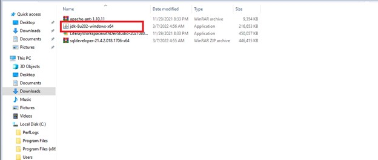 

+ Chạy file cài đặt và kích chọ Next đến khi cài đặt xong
-	Cài đặt biến mối trường
+ Kích chọn cửa sổ ->< tìm đến file môi trường

   

  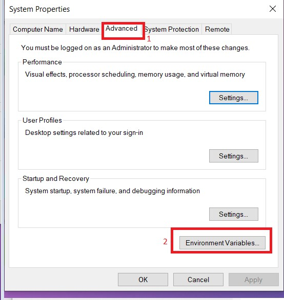 

  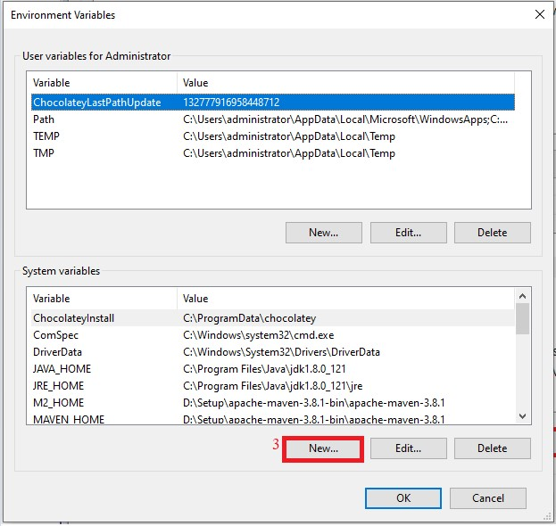 

  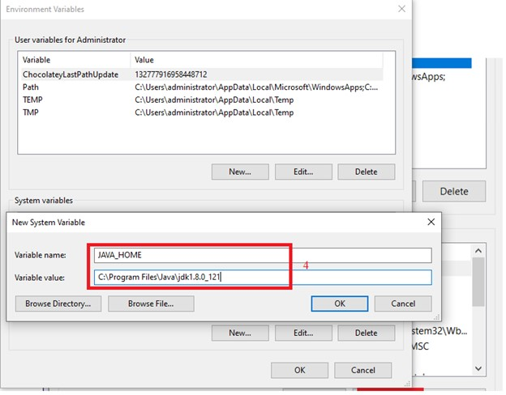 

  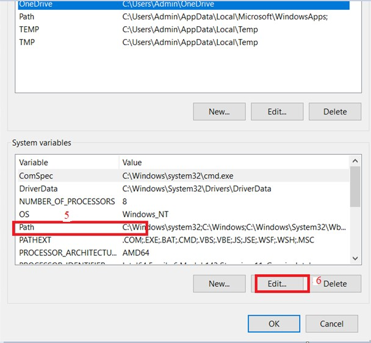 

  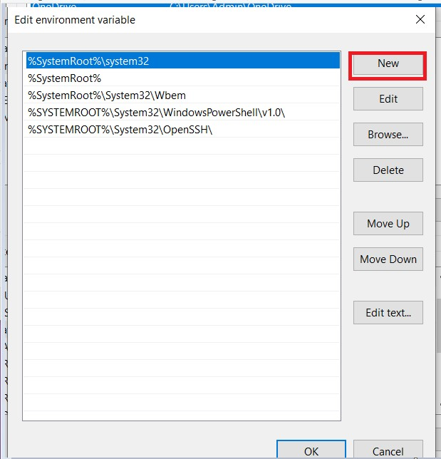 

  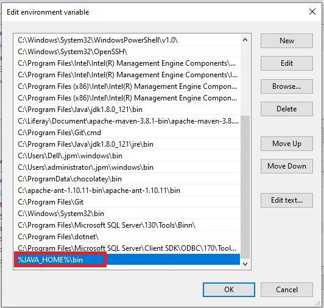 

	+ Kích chọn Ok đến lúc kết thúc
<h4>1.2.	Cài đặt môi trường apche-ant</h4>

  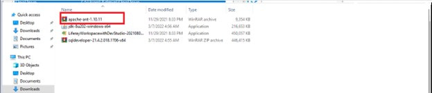 

-	Di chuyển file apache – ant vào ổ C:  và giải nén file
-	Cài dặt môi trường cho apache-ant
+ Kích chọn cửa sổ ->< tìm đến file môi trường

  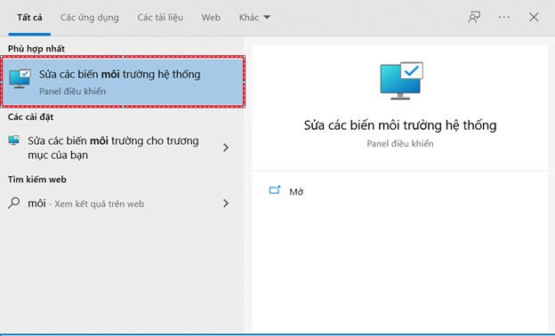 

   

  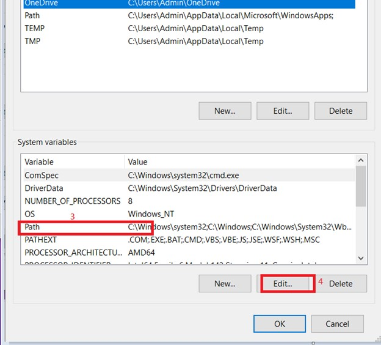 

   

  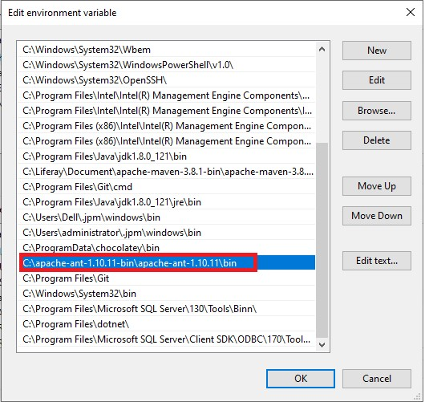 

	+ Kích chọn Ok để hoàn thành cấu hình
<h3>Phần 2: Cài đặt oracle databse 19c</h3>
<h4>2.1. Cài đặt database oracle 19c</h4>
-	Tạo đường dẫn thư mục: u01/app/oracle/19c
-	Copy file cài đặt oracle 19c vào thư mục u01/app/oracle/ 19c

  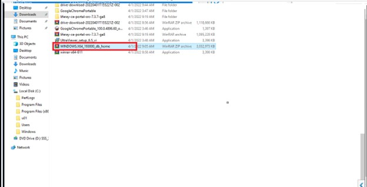 

  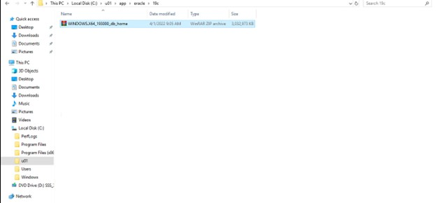 

-	Giải nén file cài đặt

  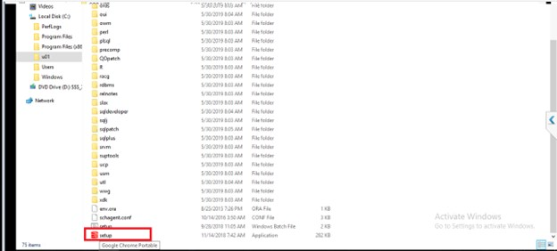 

-	Chạy file setup
{% responsive_image path:assets/images/laptrinh/lifray/setup/

  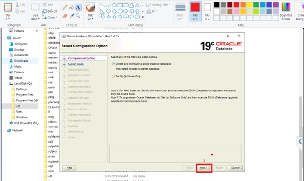 

  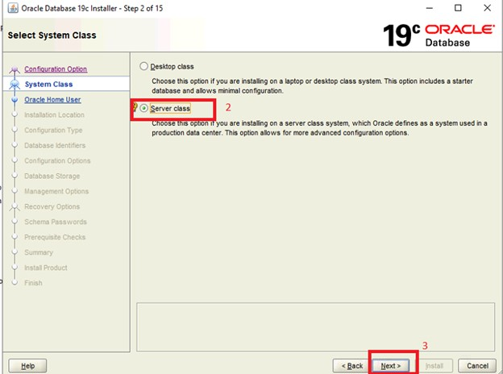 

-	Kích chọn Next liên tục  đến mà hình sau

-	chọn Next đến màn hình tiếp theo

   

  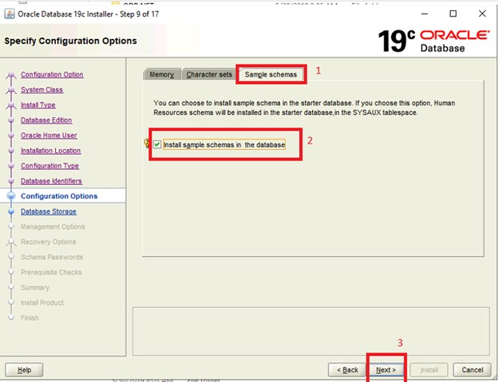 

-	kích chọn next tới màn hình’

  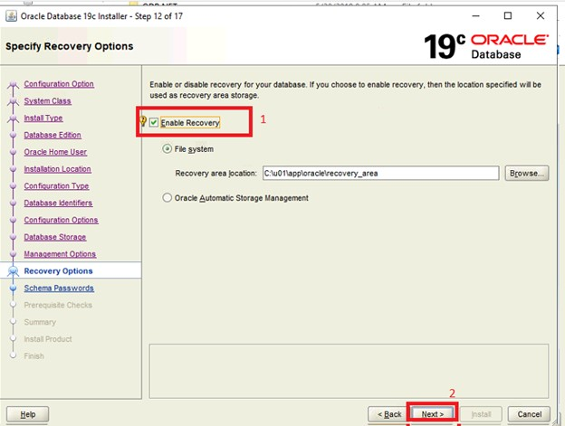 

  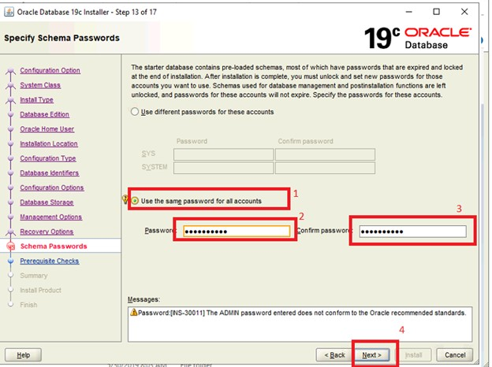 

-	điền mật khẩu dễ nhớ-> Next -> Yes

  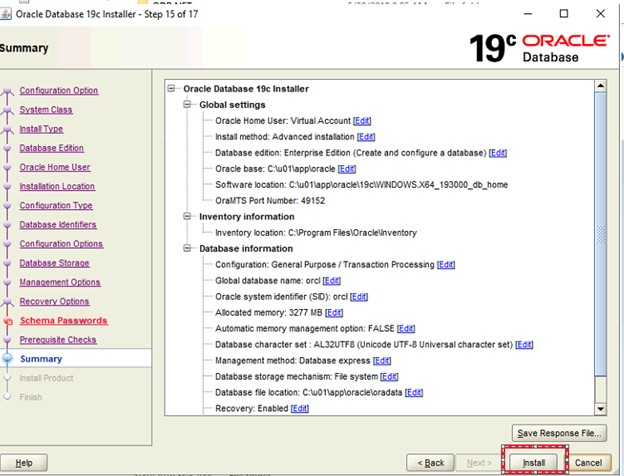 

  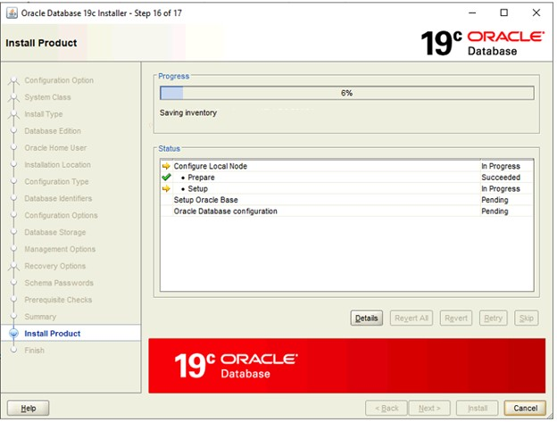 

  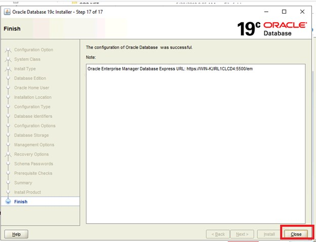 

-	close để kết thúc quá trình cài đặt
<h4>2.2. Cài đặt Sqldeveloper</h4>

  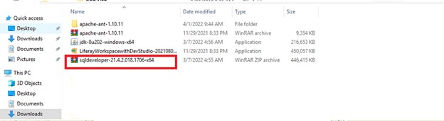 

-	Tải file cài đặt sqldeveloper và giải nén file

  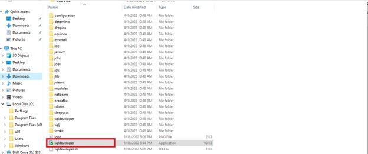 

-	Chạy file sqldeveloper

  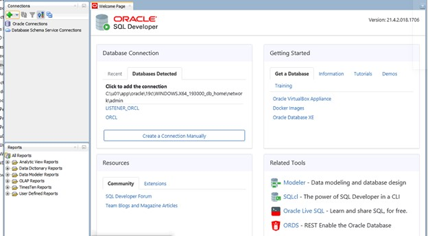 

-	Gioa điện sqldeveloper
Mở kết nối tới tài khoản quản trị SYS
-	Mở sqlplus

  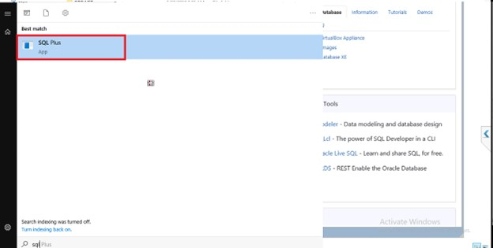 

-	Chạy câu lệnh: sqlplus / as sysdba

  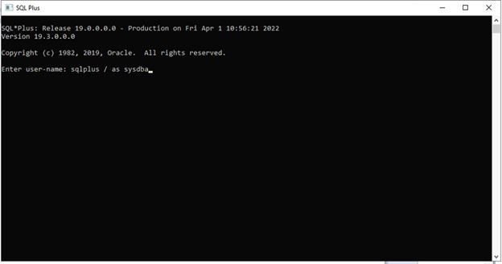 

-	Tiếp tục chạy câu lệnh: connect /as sysdba  để kết nối tới tài khoản quản trị

  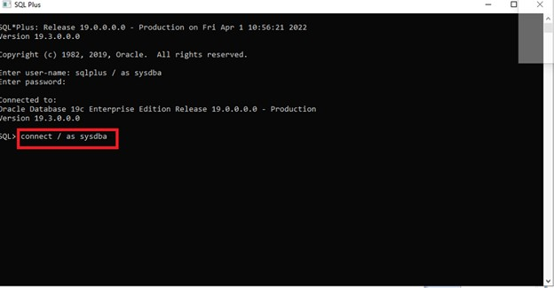 

-	Tiếp tục chạy câu lệnh: alter user sys identified by (password);( đổi mật khẩu sys)
-	Connect tới tài khoản quản trị sys
-	Khởi động sqldeveloper

  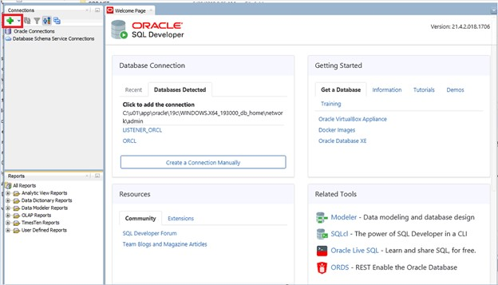 

  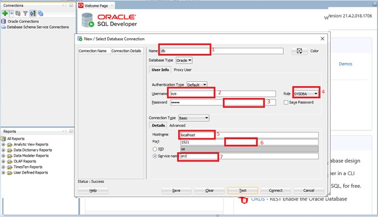 

1.	Tên (tùy ý)
2.	Username: sys
3.	Mật khẩu
4.	Role ( sysdba)
5.	Local máy chủ cài database
6.	 Port
7.	Chọn Sevice name: điền orcl
-	Tạo schemas
alter session set "_ORACLE_SCRIPT"=true;
 CREATE USER (tên user) IDENTIFIED BY (mật khẩu);
GRANT CONNECT,RESOURCE,DBA TO (tên user);
GRANT CREATE SESSION, GRANT ANY PRIVILEGE TO (tên user);
GRANT UNLIMITED TABLESPACE TO (tên user);

•	Chạy đồng thời các lệnh trên
Kết nối tới schemas vừa tạo

  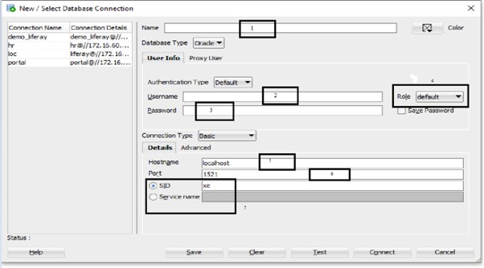 

1.	Tên database
2.	Tên user mới tạo
3.	Password
4.	Chọn default
5.	Local máy chủ cài database
6.	Port
7.	Chọn service name: điền orcl
Bấm connect

<b>Tải tài liệu ở đây:</b>

<a class="button" href="https://drive.google.com/file/d/1kWObU82PVlm1lbr85CW3O1H-ijOBTkvS/view?usp=sharing" id="download"><i class="icon download"></i> Click To Download </a>
<button class="button" id="btn"><i class="icon download"></i> Download </button>

