

<h3>Phần 3: Cài đặt Liferay Portal</h3>

Trước hết, m&aacute;y chủ phải c&agrave;i đặt sẵn Oracle JDK phi&ecirc;n bản 1.8 trở l&ecirc;n.

Y&ecirc;u cầu phần cứng tối thiểu:
<ul>	<li>Ổ cứng c&ograve;n trống &iacute;t nhất 5Gb.</li>	<li>&nbsp;Để chạy tốt RAM tối thiểu n&ecirc;n &gt;= 4Gb</li></ul>
<h4>3.1. Cấu hình kết nối CSDL</h4>
- Giải nén thư mục cài đặt Liferay



Tạo file portal-ext.properties trong thư mục liferay-ce-portal trong đường dẫn: \liferay-ce-portal-tomcat-7.3.7-ga8-20210610183559721\liferay-ce-portal-7.3.7-ga8



-	Mở file portal-ext.properties: thêm cấu hình kết nối CSDL

<blockquote>
<em>jdbc.default.driverClassName=oracle.jdbc.OracleDriver</em>

<em>jdbc.default.username=USER_NAME</em>

<em>jdbc.default.password=PASSWORD</em>

<em>jdbc.default.url=jdbc:oracle:thin:@</em><em>localhost</em><em>:1521:orcl</em>

&nbsp;

<strong>jdbc.default.username</strong>: t&ecirc;n database

<strong>jdbc.default.password</strong>: mật khẩu

<strong>localhost: </strong>địa chỉ ip server c&agrave;i đặt database
</blockquote>

-	Một vài csdl được hỗ trợ trong liferay 
<b>MySQL:</b> 
jdbc.default.driverClassName=com.mysql.jdbc.Driver 
jdbc.default.url=jdbc:mysql://localhost:3306/DATABASE_NAME?useUnicode=true& characterEncoding=UTF-8&useFastDateParsing=false 
jdbc.default.username=USER_NAME 
jdbc.default.password=PASSWORD 
<b>Posgresql:</b>
jdbc.default.driverClassName=org.postgresql.Driver  
jdbc.default.url=jdbc:postgresql://localhost:5432/DATABASE_NAME 
jdbc.default.username=USER_NAME 
jdbc.default.password=PASSWORD 
<b>SQL Server:</b> 
jdbc.default.driverClassName=net.sourceforge.jtds.jdbc.Driver  jdbc.default.url=jdbc:jtds:sqlserver://localhost:1433/DATABASE_NAME 
jdbc.default.username=USER_NAME 
jdbc.default.password=PASSWORD 
<b>Chú ý:</b> Nên sử dụng một schemas mới tránh việc xung đột dữ liệu vì liferay tự sinh ra rất nhiều bảng.
<h4>3.2. Thêm đường dẫn liferay home</h4>
- Đường dẫn chứa file cài đặt liferay: thêm liferay.home=C:/Users/Administrator/Downloads/liferay-ce-portal-tomcat-7.3.7-ga8-20210610183559721/liferay-ce-portal-7.3.7-ga8 vào file portal-ext.properties( thay đổi \ thành /)
<h4>3.3. Thêm thư viện</h4>
-	Add thư viện ojdbc8.jar vào đường dẫn: … \liferay-ce-portal-tomcat-7.3.7-ga8-20210610183559721\liferay-ce-portal-7.3.7-ga8\tomcat-9.0.43\lib\ext

   

-	Add thư viện liferay-portal-database-all-in-one-support-1.2.1 vào đường dẫn: …\liferay-ce-portal-tomcat-7.3.7-ga8-20210610183559721\liferay-ce-portal-7.3.7-ga8\tomcat-9.0.43\webapps\ROOT\WEB-INF\lib

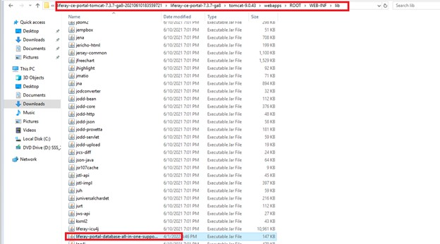 

<h4>3.4. Chạy server</h4>
Có hai cách chạy server
-	Sử dụng file startup.bat

  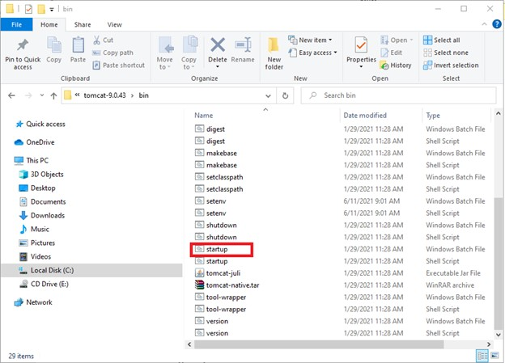 

Chuyển đến thư mục …/liferay-ce-portal-tomcat-7.3.7-ga8-20210610183559721/liferay-ce-portal-7.3.7-ga8/tomcat-9.0.43/ tomcat-9.0.43/bin/.
<ul>	<li>	
&nbsp;Hệ điều h&agrave;nh Windows: Bạn double click v&agrave;o tệp tin&nbsp;<em>startup.bat</em>
	</li></ul><ul>	<li>	
Hệ điều h&agrave;nh Linux:&nbsp;
	<ul>		<li>		
<strong>Bước 1</strong>.&nbsp;Bạn mở cửa sổ&nbsp;<em>Terminal</em>&nbsp;<em>&nbsp;(Ctri+Alt+T)</em>
		</li>		<li>		
<strong>Bước 2</strong><em>.&nbsp;</em>Chuyển sang quyền root: g&otilde; lệnh&nbsp;sudo su&nbsp;v&agrave; nhập mật khẩu.Th&ecirc;m quyền thực thi cho tệp tin&nbsp;<em>catalina.sh</em>: g&otilde; lệnh&nbsp;chmod +x&nbsp;catalina.sh
		</li>		<li>		
<strong>Bước 3</strong>.&nbsp;G&otilde; lệnh chạy chương tr&igrave;nh:&nbsp;./catalina.sh run.&nbsp;Khi m&aacute;y chủ đưa ra th&ocirc;ng b&aacute;o: &quot;INFO: Server startup in xxxx ms&quot;&nbsp;nghĩa l&agrave; m&aacute;y chủ đ&atilde; khởi động xong.&nbsp;
		</li>	</ul>	</li></ul>
-	Sử dụng liferay developer chạy server

  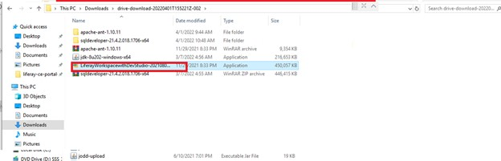 

-	Chạy file cài đặt liferay developer

  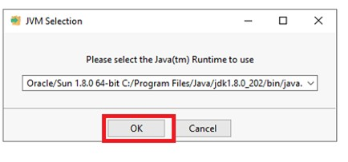 

   

-	Kích chọn next cho tới khi cài đặt xong
-	Chạy liferay developer

  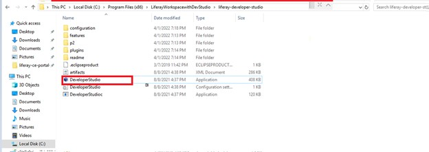 

Thêm server liferay

  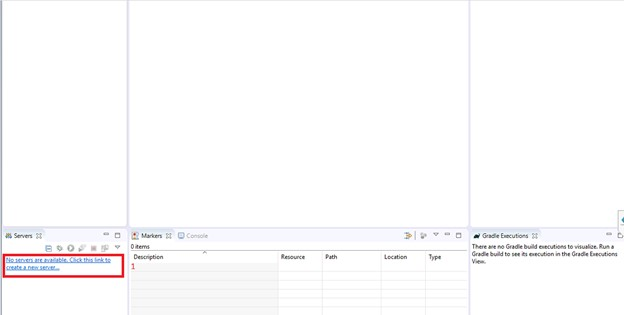 

  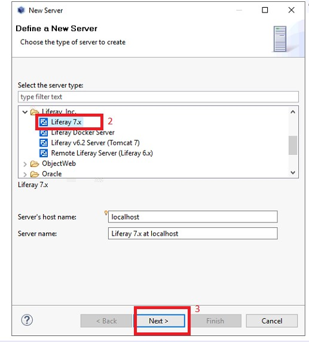 

-	Thêm đường dẫn liferay: C:\Users\Administrator\Downloads\liferay-ce-portal-tomcat-7.3.7-ga8-20210610183559721\liferay-ce-portal-7.3.7-ga8

  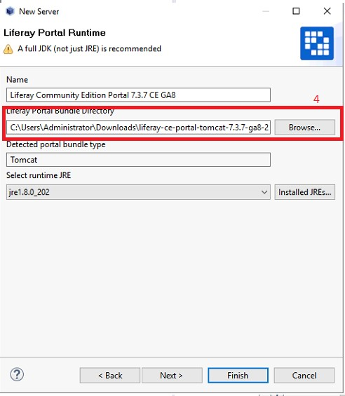 

  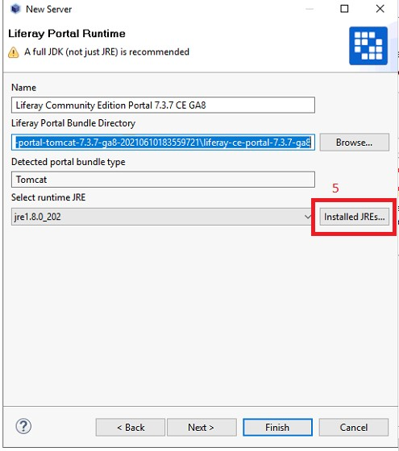 

  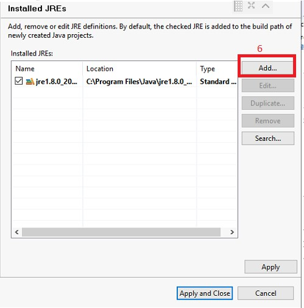 

  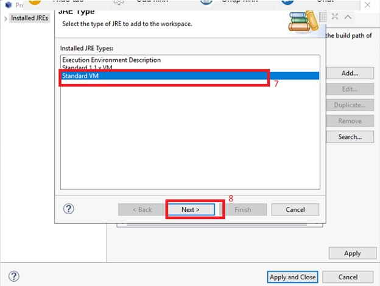 

  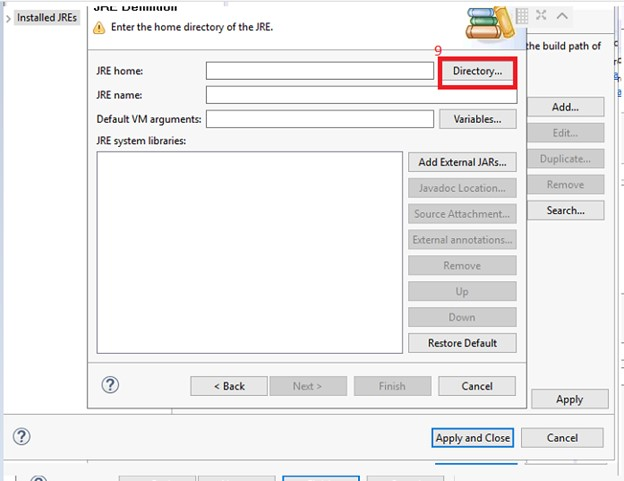 

-	Chọn đến file cài đặt jdk

  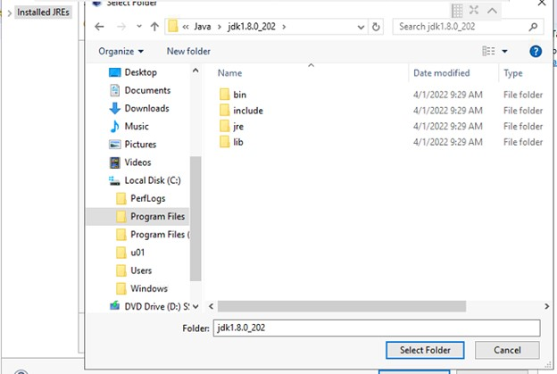 

  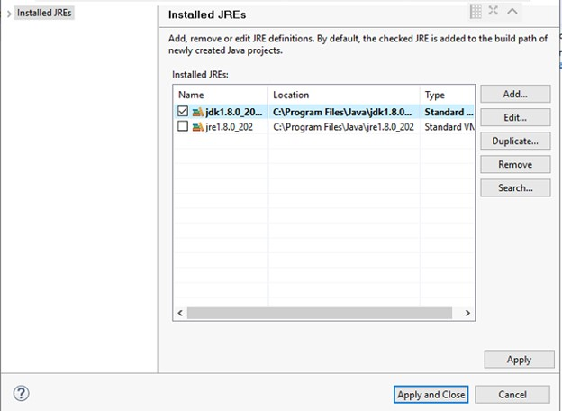 

-	Chạy server

  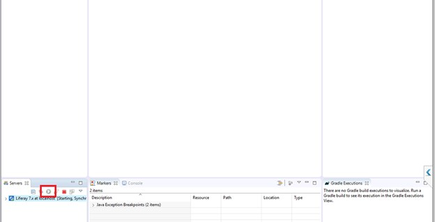 

-	Truy cập vào địa chỉ 10.7.57.86

  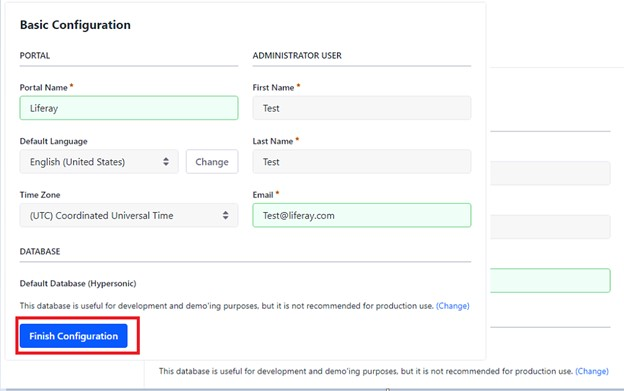 

-	Chọn finish để hoàn tất cấu hình
-	Làm theo các bước thay đổi mật khẩu và xác thực

  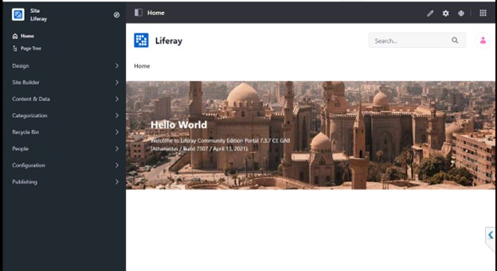 
  Giao diện liferay

<b>Tải tài liệu ở đây:</b>

<a class="button" href="https://drive.google.com/file/d/1xP4kCtnGs1204WWUI0bWXO3RYEZcknJA/view?usp=sharing" id="download"><i class="icon download"></i> Click To Download </a>
<button class="button" id="btn"><i class="icon download"></i> Download </button>

