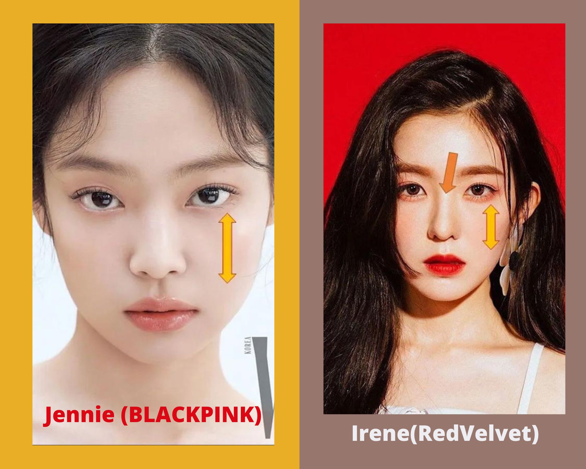
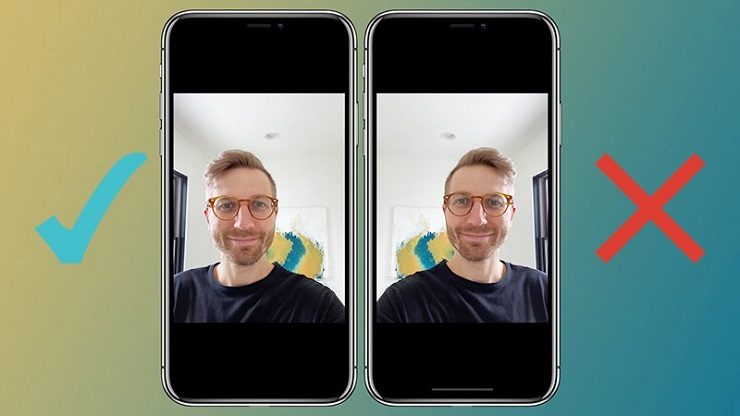
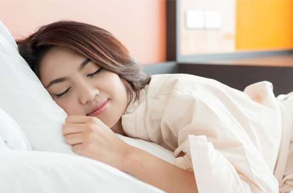
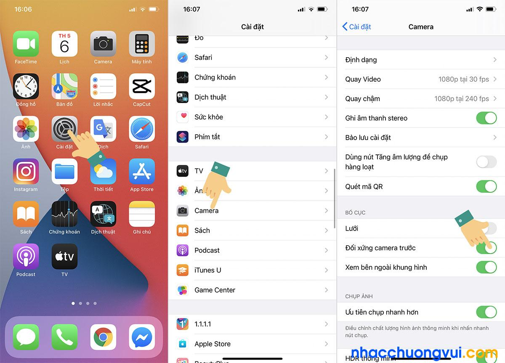
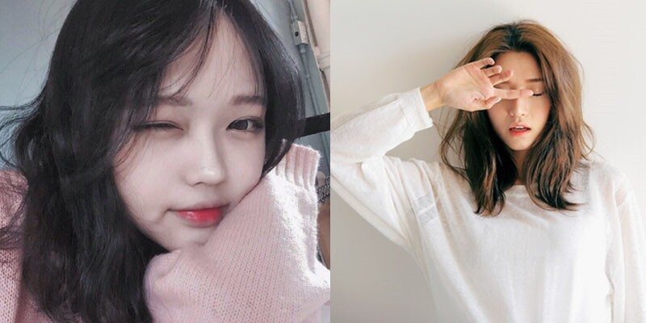
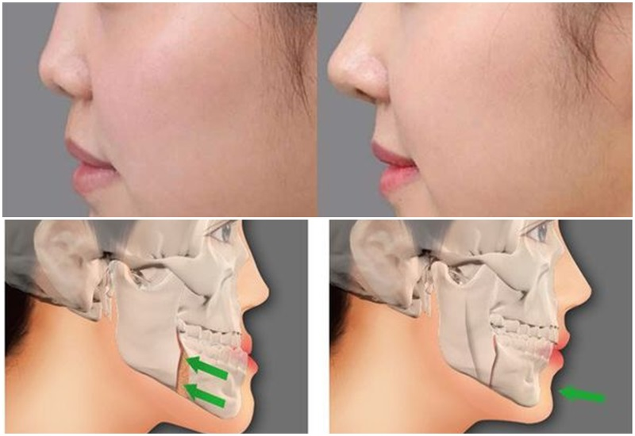
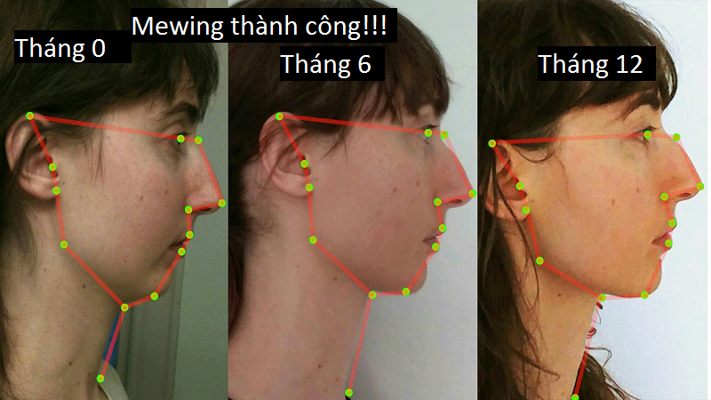

Chúng ta lại có hứng thú đặc biệt với những thứ có [tính đối xứng](#doixung). Con sao biển hay các cánh hoa có hình dạng đối xứng xuyên tâm, tổ ong hình lục giác đối xứng, hay những họa tiết pha lê đối xứng độc đáo của một bông tuyết. Và tất nhiên con người cũng là những sinh vật đối xứng. Nhưng về ngoại hình, khuôn mặt của chúng ta rất dễ bị **lệch** - mất đi tính đối xứng đó. **Tại sao vậy? và Cách khắc phục là gì?**

### Mục lục

[1. Nguyên nhân](#nguyennhan)\\
[2. Tips chụp ảnh cho người mặt lệch](#tipchup)\\
[3. Cách khắc phục gương mặt bị lệch tốt hiệu quả](#khacphuc)

  <picture>

    <source type="image/webp" srcset="../../assets/images/nhiepanh/doituong/matlech-02.webp">
    <source type="image/jpeg" srcset="../../assets/images/nhiepanh/doituong/matlech-02.jpg">
    

  </picture>

<a href="https://kenh14.vn/sao-kbiz-mat-bi-lech-nhung-van-thanh-cuc-pham-nhan-sac-jennie-irene-tzuyu-thanh-luon-nu-than-kim-soo-hyun-hot-thay-la-20201215121007454.chn" target="_blank">Sự cân xứng trên gương mặt được cho là tiêu chí hàng đầu tạo nên nhan sắc cho 1 người. - kenh14.vn </a>

### 1. Nguyên nhân

  

    <picture>
      <source type="image/webp" srcset="../../assets/images/nhiepanh/doituong/anh-selfie-bi-nguoc-trang.webp">
      <source type="image/jpeg" srcset="../../assets/images/nhiepanh/doituong/anh-selfie-bi-nguoc-trang.jpg">
      
    </picture> 
    Nhiều người thắc mắc tại sao trên iPhone chụp ảnh selfie bị ngược?
  

Đương nhiên là do cái **máy ảnh** rồi :)). Khi chụp camera trước bị lệch mặt, hoặc thậm chí cả trên camera thực chất không phải là lỗi mà chỉ là một nguyên tắc cơ bản khi chụp ảnh. Thông thường camera trên điện thoại sẽ thu hình đối tượng chụp giống như một người đang đứng đối diện nhìn bạn. Khi đó bên phải của bạn sẽ là bên trái của họ.

Đó là nguyên nhân chủ quan về mặt phần cứng của thiết bị bạn đang sử dụng. Nhưng nếu nguyên nhân chính đến từ bạn thì sao. **Tại sao mặt lại bị lệch nhỉ?**

Trong số những nguyên do gây ra sự không đều của khuôn mặt thì những thói quen chiếm một tỉ lệ khá lớn. Thói quen xấu được lặp đi lặp lại trong thời hạn dài sẽ làm biến hóa cấu trúc mặt và làm cho khuôn mặt không cân đối. Một số hoàn toàn có thể kể đến như :

* Mặt không cân đối do bẩm sinh: Có những người có khuôn mặt kém cân đối từ khi sinh ra. Đó là do di truyền từ những người thân trong gia đình. Trường hợp này rất khó để hoàn toàn có thể cải tổ trọn vẹn vì khung xương bị lệch.
* Nằm nghiêng một bên bị lệch mặt: Kiểu nằm này khiến cho bên mặt áp xuống gối nhiều nhỏ hơn so với bên mặt còn lại, làm cho mặt bên to bên nhỏ. Nằm nghiêng bị lệch mặt là thực trạng rất thông dụng lúc bấy giờ.
  

* Nhai bằng một bên hàm: Khuôn mặt sẽ trở nên rơi lệch, thậm chí còn lệch hẳn về bên hàm nhai với thời hạn dài sẽ tạo thành thói quen khiến người nhai tự động hóa chuyển thức ăn về bên đó.
* Ngoài ra lệch mặt còn do các vấn đề về răng hoặc các bệnh lý gây nên. Răng là một trong những nguyên do đáng quan tâm gây ra sự không bình thường cho khuôn mặt. Những người có hàm tăng trưởng không đúng cấu trúc, hay còn gọi là hàm răng bị lệch sẽ làm lệch khớp cắn và mất cân đối hàng loạt khuôn mặt. Tùy theo từng kiểu lệch của hàm mà mặt sẽ bị tác động ảnh hưởng theo. Có những kiểu lệch hàm như lệch trái, lệch phải, hàm nhô ra phía trước hay thụt quá sâu vào trong .
  Những người cao tuổi hay những người mắc các bệnh lý về huyết áp, tim mạch, tiểu đường rất dễ bị các biến chứng gây liệt cơ mặt. Tình trạng này thường khiến cho bệnh nhân bị mặt méo, cứng miệng, hay không mở được mắt.

### 2. Tips chụp ảnh cho người mặt lệch

Để có được những bức ảnh xinh xắn không bị mất cân đối gương mặt, Admin sẽ gợi ý cho bạn tips nho nhỏ để chụp ảnh cho người mặt lệch.

Điều đầu tiên là chỉnh sửa trên chính phần mềm chụp ảnh của bạn.Trên điện thoại iPhone iOS 14, người dùng có thể sử dụng tính năng chụp ảnh bằng camera không bị lệch mặt, không bị ngược ảnh.

  

    <picture>
      <source type="image/webp" srcset="../../assets/images/nhiepanh/doituong/tai-sao-chup-anh-camera-sau-mat-bi-lech-4.webp">
      <source type="image/jpeg" srcset="../../assets/images/nhiepanh/doituong/tai-sao-chup-anh-camera-sau-mat-bi-lech-4.jpg">
      
    </picture> 
    Bạn có thể kích hoạt tính năng này trong phần Cài đặt của điện thoại iPhone như sau: Mở mục Cài đặt trên điện thoại iPhone >> chọn mục Camera >> chọn mục Đối xứng camera trước
  

Dùng tay che bên phần mặt mà bạn cảm thấy bị lệch. Đây là một trong những cách chụp cam thường không bị méo mặt. Cách này giúp che đi những khuyết điểm trên khuôn mặt bạn, đồng thời gương mặt khi lên hình cũng nhỏ hơn.

  

    <picture>
      <source type="image/webp" srcset="../../assets/images/nhiepanh/doituong/khacphuc-matlech-01.webp">
      <source type="image/jpeg" srcset="../../assets/images/nhiepanh/doituong/khacphuc-matlech-01.jpg">
      
    </picture> 
    Dùng tay che một bên gương mặt 
    
    Hơi vươn cổ, đưa cằm ra một chút để tăng khoảng cách với phần còn lại của khuôn mặt.
  

Tuy rằng ta có thể dùng một cái thủ thuật để che đi khuyết điểm khi chụp ảnh. Nhưng việc xác định nguyên nhân và cách khắc phục triệt để khuyết điểm đi luôn là thứ mà chúng ta hướng tới.

### 3. Cách khắc phục gương mặt bị lệch tốt hiệu quả

  

    <picture>
      <source type="image/webp" srcset="../../assets/images/nhiepanh/doituong/khacphuc-matlech-03.webp">
      <source type="image/jpeg" srcset="../../assets/images/nhiepanh/doituong/khacphuc-matlech-03.jpg">
      
    </picture>
  

  
Cải thiện gương mặt mà phương pháp Mewing

 <ul>

         <li>Massage mặt là một trong những cách đơn thuần và không hề tốn kém để cải tổ thực trạng này. Hiện nay trên mạng có rất nhiều bài tập giúp cải tổ cơ mặt đồng thời thư giãn giải trí da.
          <ul>
            <li>Dùng tay massage đều đặn, nhẹ nhàng khuôn mặt theo chiều từ dưới cằm đưa lên, và từ trong ra ngoài;  </li>
            <li>Ở vùng trán và ngang cằm, bạn hãy sử dụng một lực vừa đủ để massage theo đường vòng tròn cùng chiều kim đồng hồ, tạo cảm giác dễ chịu, thoải mái.</li>
          </ul>
          Bạn nên áp dụng phương pháp này thường xuyên đều đặn vào mỗi ngày để nâng cao hiệu quả. Có thể sử dụng cách này khi rửa mặt để cơ mặt được thư giãn tốt nhất, đồng thời giúp sữa rửa mặt thấm sâu vào da, lấy đi các bụi bẩn một cách tốt hơn.
         </li>
         <li>Cải thiện các thói quen xấu: Tình trạng mặt bị lệch sẽ càng trở nên tồi tệ hơn nếu những thói quen này liên tục được duy trì. Hãy rèn luyện cho mình cách nằm ngửa hay nhai bằng cả hai bên hàm điều này giúp khuôn mặt từ từ lấy lại sự cân đối bắt đầu.</li>

</ul>

Lưu ý: Các giải pháp trên chỉ tác động ảnh hưởng từ bên ngoài nên không thật sự mang lại hiệu suất cao như mong ước. Một số giải pháp dưới đây Admmin vẫn đang thực hiện. Nặng đô hơn và hiệu quả hơn.
<ul>
         <li>Mewing: Mewing là phương pháp luyện tập cách đặt lưỡi đúng vị trí nhằm giúp thon mặt, nâng cao sống mũi và xương hàm, giúp cải thiện gương mặt theo hướng tích cực hơn. Phương pháp này được nghiên cứu bởi bác sĩ John Mew và được phổ biến rộng rãi bởi con trai của ông là bác sĩ chỉnh nha Mike Mew.
         <li>Niềng răng: Đây cũng là cách Admin thực hiện, nhưng trong khuôn khổ bài viết, ta sẽ không bàn thêm.</li>
        

          <picture>
            <source srcset="../../assets/images/nhiepanh/doituong/khacphuc-matlech-02.webp" type="image/webp" >
            <source type="image/png" srcset="../../assets/images/nhiepanh/doituong/khacphuc-matlech-02.png">
            
          </picture>
           
          Quá trình thực hiện phương pháp Mewing
        

        Bạn có thể đọc thêm về Mewing. <a href="https://www.youtube.com/results?search_query=mewing" target="_blank">ở đây</a> hoặc <a href="https://www.youtube.com/watch?v=Lg4h6KvURrg" target="_blank">đây</a>.
        </li>
</ul>

### Trích nguồn

* [Tại sao chụp ảnh camera sau mặt bị lệch? Một số mẹo khắc phục hiệu quả - ghiencongnghe.info](https://ghiencongnghe.info/tai-sao-chup-anh-camera-sau-mat-bi-lech.html).
* [Sao Kbiz mặt bị lệch nhưng vẫn thành cực phẩm nhan sắc - kenh14.vn](https://kenh14.vn/sao-kbiz-mat-bi-lech-nhung-van-thanh-cuc-pham-nhan-sac-jennie-irene-tzuyu-thanh-luon-nu-than-kim-soo-hyun-hot-thay-la-20201215121007454.chn).
* [NHỮNG THÓI QUEN XẤU LÀM GƯƠNG MẶT BỊ LỆCH VÀ CÁCH KHẮC PHỤC HIỆU QUẢ - nhakhoavinhan.com](https://nhakhoavinhan.com/mat-bi-lech/).

> Bạn là chính bạn, là một ngôi sao. Đừng vì gương mặt bất đối xứng mà mặc cảnh, tự ti.

