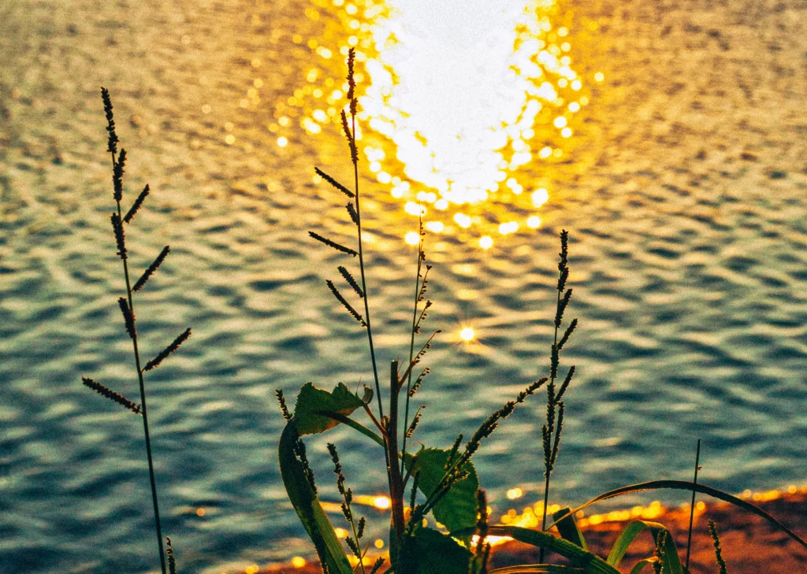
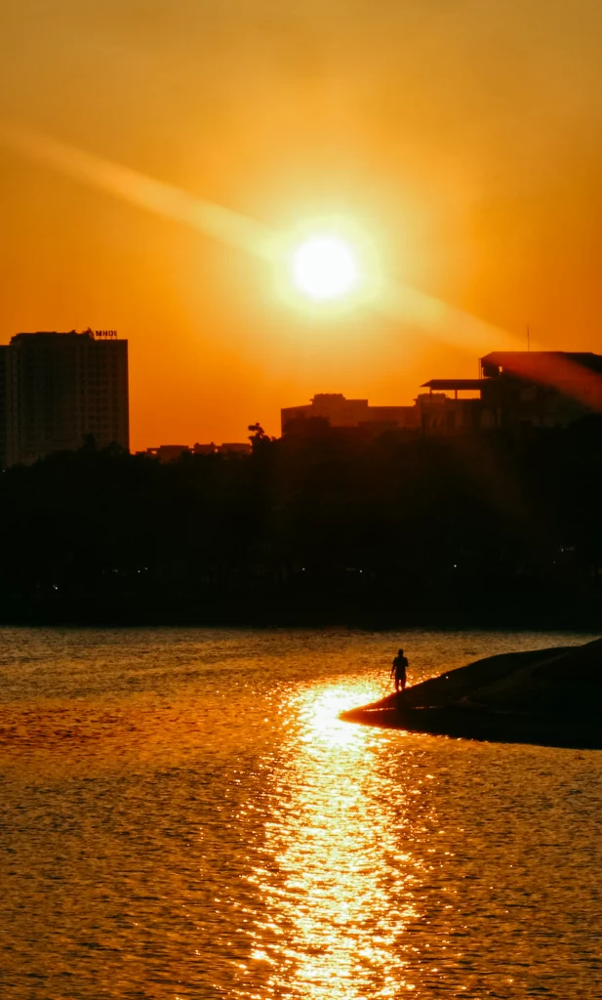
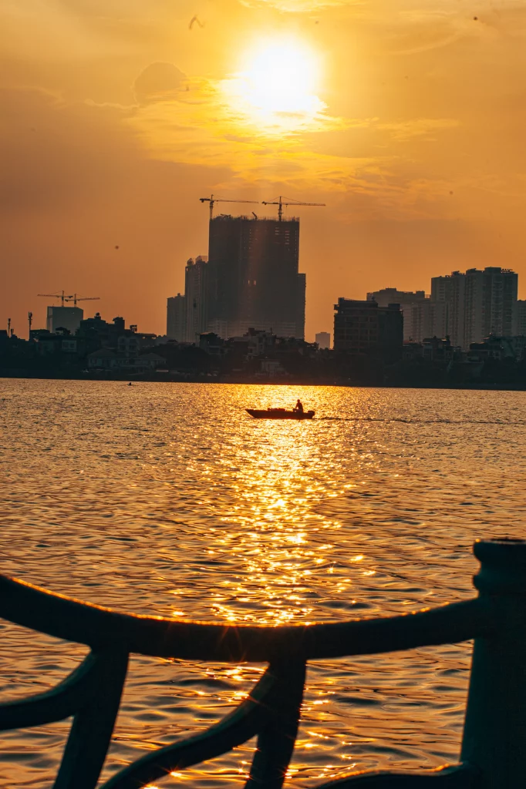

Thời điểm chụp ảnh ngược nắng đẹp nhất là giờ vàng, lúc bình minh cũng như sẩm tối. Từ 7 đến 11 giờ thường là thời điểm có nắng xiên, nhưng nếu muốn săn ảnh đẹp, khi đường phố còn vắng vẻ, tinh khôi, chắc chắn bạn nên đi sớm. Dậy sớm hơn thường lệ và mang đồ nghề lên đường, dù là máy phim, máy cơ hay máy số thì hình ảnh của ánh nắng xiên được ghi lại qua ống kính đều mang một nét đẹp riêng có. Còn với những bạn cú đêm khó dậy sớm, thì có lẽ khung giờ từ 17 giờ vào mùa hè có lẽ là sự lựa chọn tối ưu nhất. (~‾▽‾)~ 

  
  Hồ Linh Đàm.

Hồ Tây là một địa điểm thích hợp để thực hành chụp ảnh ngược nắng. Hồ Tây khiến người ta mê đắm và ngây ngất nhất thì phải kể đến khoảnh khắc hoàng hôn mỗi buổi chiều tà. Nếu ai đó vô tình lướt qua đây vào đúng lúc này, hẳn đều muốn dừng chân nán lại, hoặc ít nhất là chẳng nỡ đi nhanh. Bởi một vùng trời rộng lớn trước mặt đang chuyển màu đỏ rực, hoặc khi là cam vàng, tím hồng đầy mê hoặc, cứ ngỡ chỉ có trong tranh ảnh hay trong những thước phim sẽ khiến người ta xao xuyến, ấn tượng ngay lập tức.

Chìa khóa để chụp ngược sáng là: chọn một chủ thể mạnh mẽ với một hình dạng xác định và dễ nhận biết; tắt đèn flash để có càng ít ánh sáng phía trước đối tượng càng tốt; lấy ánh sáng phù hợp bằng cách có nhiều ánh sáng chiếu từ hậu cảnh hơn tiền cảnh;

   
  Hồ Tây một chiều hè.

<b>Dưới đây</b> là một số khẩu khuyết giúp bạn chụp thể loại ngược sáng <b>tốt hơn</b>:
<ul>
  <li><b>ĐÚNG NƠI ĐÚNG LÚC</b>: Trước hết, để có thể chụp ảnh ngược sáng thì bạn cần chọn được cho mình một địa điểm chụp ảnh lý tưởng và một khung giờ chụp ảnh lý tưởng. Lưu ý đến trước 30p để setup trang phục và bố cục. Ảnh hoàng hôn chụp dễ hơn bình mình(Cú đêm như mình :P)</li>
  <li><b>ĐỨNG ĐÚNG VỊ TRÍ</b>: Bạn sẽ phải đứng chính diện nguồn sáng. Luôn đảm bảo background của mình sáng hơn chủ thể nhé thì chủ thể mới “tối đi” được. Đeo kính dâm trông ngầu hơn và bớt đau mắt hơn😎😎</li>
    <li><b>TỐI NGƯỜI SÁNG CẢNH</b>: Thông thường khi chụp ảnh thì bạn luôn muốn chủ thể của mình sáng nhất có thể, nhưng để tạo cho người xem nhiều suy nghĩ hơn. THì phải bí hiểm😉 </li>
        <li><b>HẬU KỲ</b>: Nhớ bật chế độ lưu ảnh RAW trên điện thoại hoặc máy ảnh của bạn có chất lượng hình ảnh tốt nhất để khi về ta có thể chỉnh sửa hình ảnh một cách dễ dàng nhất. Vì thế nếu phần bóng đen không đủ đen bạn có thể về kéo lại được ngay.</li>
</ul>

  
  Đừng chỉ đứng im, hãy bước đi thật tự nhiên để bức ảnh trông sống động hơn.

<b>Lưu ý</b>: Với kiểu chụp ảnh ngược sáng, hãy đảm bảo rằng tay chân không đứng quá khít vào nhau như thế sẽ tránh tạo thành một vùng đen xì trong bức ảnh và nhìn sẽ không ra được hình người mất 😂🤣
