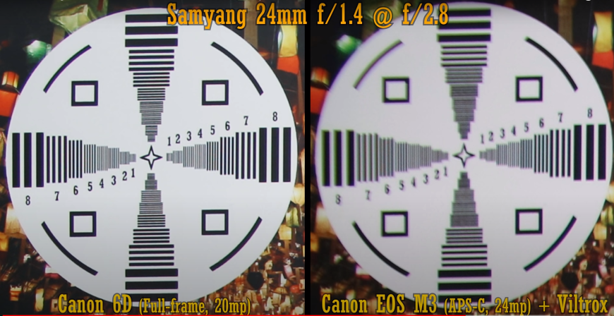
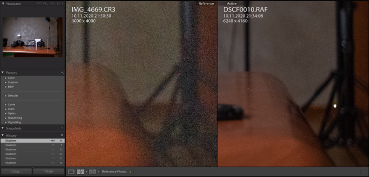
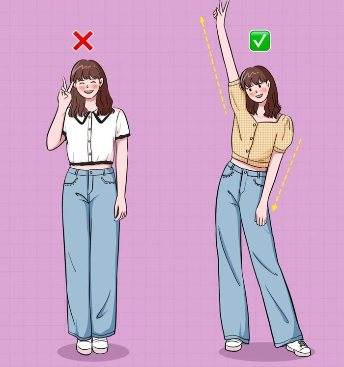
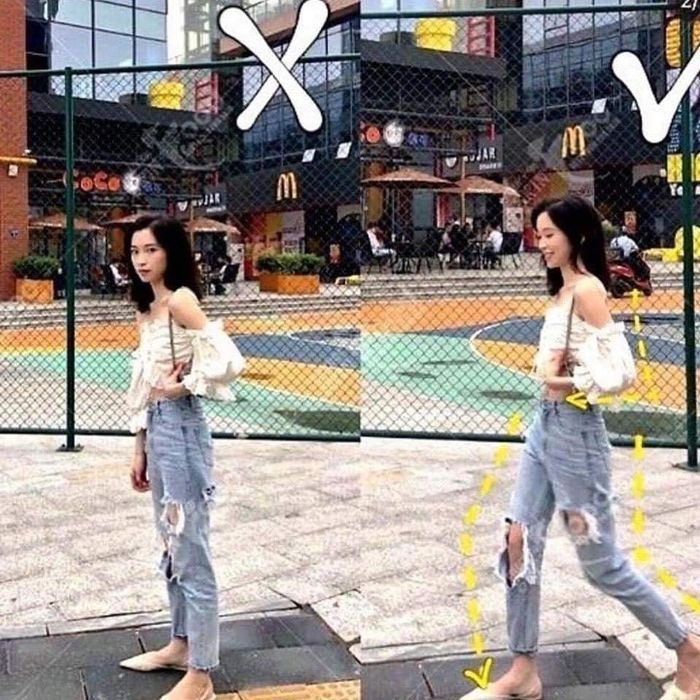
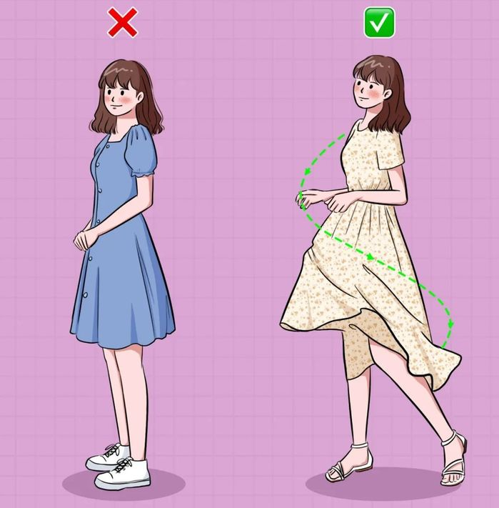
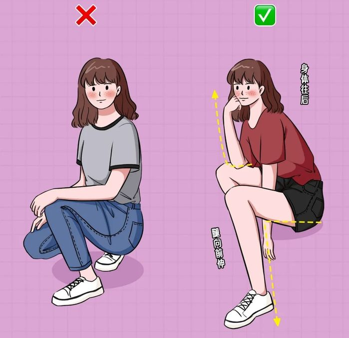
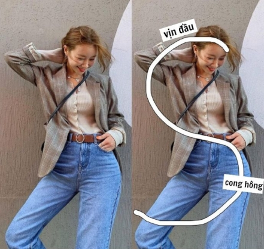
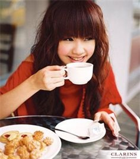

<!-- wp:paragraph -->

<strong>Đánh giá: Tốt</strong>

<!-- /wp:paragraph -->

<!-- wp:paragraph -->

<strong>Giá Viltrox Canon EF-EOS M2:</strong> 2tr5 - 2tr8 triệu hàng mới(giá năm 2022)

<!-- /wp:paragraph -->

<!-- wp:paragraph -->

<strong>Năm:</strong>&nbsp;2019

<!-- /wp:paragraph -->

<!-- wp:paragraph -->

<strong>Đối tượng:</strong>&nbsp;nhiếp ảnh nghiệp dư, người chơi ảnh&nbsp;bình dân, học sinh, sinh viên

<!-- /wp:paragraph -->

<!-- wp:paragraph -->

<strong>Phù hợp:</strong> chụp chân dung, phong cảnh, kiến trúc

<!-- /wp:paragraph -->

### Mục lục

[1. Đừng đứng như pho tượng](#tip1)\\
[2. Thả lỏng 2 tay](#tip2)\\
[3. Ngực tấn công, mông phòng thủ (ʘ ͜ʖ ʘ)](#tip3)\\
[4. Thêm phụ kiện, thêm tự tin](#tip4)\\
[5. Chụp chuyển động](#tip5)

<!-- wp:heading -->
<h2>1. Cấu tạo và thiết kế    </h2>
<!-- /wp:heading -->

<!-- wp:paragraph -->

Ngàm chất lượng hoàn thiện rất tốt, thấu kính multicoated 2 mặt cho độ xuyên sáng và chất lượng hình ảnh cực chuẩn. 

<!-- /wp:paragraph -->

<!-- wp:paragraph -->

<strong>Ngàm Viltrox&nbsp;</strong>được thiết kế coppy lên đến 99% của Ngàm chính hãng Canon. Cả 2 ngàm đều có đế gắn tripod dễ dàng&nbsp;gắn được cho nhau nếu bạn làm&nbsp;mất. Điểm đặc biệt của ngàm Canon là được đóng trong 1 hộp carton màu xám rẻ tiền, ngược lại&nbsp;ngàm Viltrox lại được đóng trong 1 hộp màu chắc khá sang chảnh.&nbsp;

<!-- /wp:paragraph -->

<!-- wp:paragraph -->

Phầm ngàm mạ Crop của ngàm Canon trông&nbsp;sáng và mịn hơn so với ngàm Viltrox. Nên độ chắc chắn tương đối ổn định khi gắn len tuy nhiên&nbsp;vẫn có 1 độ dơ nhẹ. Bên cạnh đó, ngàm Viltrox EF-EOS M cũng có độ dơ nhưng nhiều hơn 1 chút.

<!-- /wp:paragraph -->

<!-- wp:paragraph -->

Khi dùng tay giữ len, 1 tay giữ body M50 để lắc thì cả 2 ngàm này&nbsp;đều làm cho&nbsp;lắc và có 1 độ dơ như kể trên. Tuy vậy,&nbsp;máy vẫn có thể nhận khẩu độ và tốc độ của lens bình thường và bắt nét bình thường.

<!-- /wp:paragraph -->

<!-- wp:paragraph -->

Các chấu dẫn điện của 2 ngàm đều được làm bằng đồng, về ngàm của Canon sẽ khác biệt hơn&nbsp;khi mặt ngàm tiếp xúc với thân Body là những chấu có dạng hình vuông. Trong khi đó, Viltrox EF - EOS M là hình tròn. Hai ngàm này đều hoạt động khá ổn định&nbsp;mà không có hiện tượng mất khẩu, hở sáng.&nbsp;

<!-- /wp:paragraph -->

<!-- wp:paragraph -->

Về điểm chất lượng và độ hoàn thiện,&nbsp;<strong>Ngàm chuyển của Viltrox</strong>&nbsp;vẫn được đánh giá cao hơn.&nbsp;

<!-- /wp:paragraph -->

<!-- wp:heading -->
<h2>2. Tính năng và hoạt động </h2>
<!-- /wp:heading -->

<!-- wp:paragraph -->

Ngàm adaptor dùng để gắn ống kính Canon EOS (lens EF và Lens EFs) lên máy ảnh EOS M. + Tốc độ lấy nét tương đương ngàm Canon EOS - EOS M. + Chức năng booster tăng độ sáng của ống kính lên 1 fstop, tiêu cự ống kính sẽ rộng hơn theo hệ số x0.71.

<!-- /wp:paragraph -->

<!-- wp:table {"hasFixedLayout":true} -->
<figure class="wp-block-table"><table class="has-fixed-layout"><tbody><tr><td>Tiêu chí so sánh</td><td><strong>0.71x EF-M speedbooster</strong></td><td><strong>EF-M mount adapter</strong></td></tr><tr><td>Dùng cho</td><td>EF-M mount cameras</td><td>EF-M mount cameras</td></tr><tr><td>Ngàm hỗ trợ</td><td>chỉ ngàm EF</td><td>ngàm EF/EF-S</td></tr><tr><td>Tiêu cự</td><td>tiêu cự x 1.6 x 0.71</td><td>tiêu cự x 1.6</td></tr><tr><td>Độ sáng</td><td>tăng lên 1</td><td>x</td></tr><tr><td>Tự động lấy nét</td><td>v</td><td>v</td></tr><tr><td>IS</td><td>v</td><td>v</td></tr><tr><td>Cập nhật thông qua usb </td><td>v</td><td>x</td></tr></tbody></table><figcaption>So sánh ngàm viltrox ef-eos m2 và ngàm ef-eos</figcaption></figure>
<!-- /wp:table -->

<!-- wp:paragraph -->

<strong>Ví dụ:</strong> gắn lens 50mm F1.4 

<!-- /wp:paragraph -->

<!-- wp:paragraph -->

=&gt; Nếu vào ngàm EOS M hoặc ngàm của Canon thì sẽ thành <strong>75mm F1.4</strong> Nhưng nếu gắn vào ngàm Viltrox-EF-EOSM2 sẽ thành 50mm x 1.6&nbsp;x&nbsp;0.71x = <strong>56.8mm F1.0</strong> (<strong>Khẩu độ tăng lượng ánh sáng nhiều hơn, giúp chụp thiếu sáng tốt hơn</strong>). 

<!-- /wp:paragraph -->

<!-- wp:paragraph -->

Bình thường bạn phải x1.6 nhưng giờ chỉ cần x1.1. Khẩu độ lens là f2 - sẽ thành f1.4, từ f4 - sẽ thành f2.8, quá hấp dẫn phải không nào. Trường nhìn (DOF) vẫn là F.14.

<!-- /wp:paragraph -->

<!-- wp:paragraph -->

Bắt đầu đau đầu phải không nào. không sao, ta hãy cùng đến ngay với chất lượng thực tế mà adapter cho ra.

<!-- /wp:paragraph -->
<h2>3. Chất lượng hình ảnh </h2>
   
Nhìn tổng thể bức ảnh thì Viltrox-EF-EOSM2 có vẻ hẹp hơn một chút. độ nét vùng trung tâm khá tốt, nhưng cùng zoom phần rìa ảnh thì hình ảnh có xuất hiện viền tím. Phải khép khẩu rất sâu mới đỡ.
   

Dù cấp cho bạn góc nhìn tiệm cận fullframe nhưng vì cảm biến nhỏ hơn, bạn vẫn có thể nhận thấy noise rõ rệt.
   

<h3>1. Đừng đứng im</h3>

  Nghiêm túc rồi, bây giờ bạn có thể lột xác với các động rác uyển chuyển của tay và chân như: tay chống eo, tay đưa lên làm như hất tóc để tạo và nhấn các đường cong. 

            Thay vì đứng giơ 2 ngón tay quá đơn giản và không có điểm nhấn, bạn hãy đưa một chân sang một cách tự nhiên, một tay ép vào thân mình, tay kia giơ thẳng lên và "Say hi". 

   

  
  Đừng chỉ đứng im, hãy bước đi thật tự nhiên để bức ảnh trông sống động hơn.

Hãy thoải mái nhất có thể, thả lỏng cơ thể, hai cánh tay và chân sẽ giúp bức hình của bạn đẹp hơn so với việc vòng tay trước bụng như một “thanh niên nghiêm túc” không đúng lúc vậy đó.

<h3>2. Thả lỏng 2 tay</h3>
  

    
    Không cần phải ngồi thu người, khép nép, hãy tạo điểm nhấn bằng cách bắt chéo chân, tay đặt lên đầu gối, chống cằm
  

  

    
    Đừng chỉ đặt tay lên đùi rồi ngồi nghiêng một cách nhàm chán, để thu hút ánh nhìn, bạn nên đưa một chân ra trước, đẩy hông sang một bên để trông "xì tai" hơn.
  

<h3>3. (ʘ ͜ʖ ʘ) Ngực tấn công, mông phòng thủ</h3>

   
  Chụp theo kiểu chữ S: Tay ôm đầu, cong hông.

<h3>4. Thêm phụ kiện, thêm tự tin</h3>
  

    
    Cầm một cành hoa, một chén trà và nghĩ đến những câu chuyện thú vị: Đây là cách giúp gương mặt và nụ cười của bạn trở nên tự nhiên hơn.
  

<h3>5. Chụp chuyển động</h3>
Nếu bạn chỉ đứng im một chỗ thì không giống ảnh đường phố lắm. Nhưng khi chuyển động thì sẽ khá khó cho bạn chụp. Vậy có bí quyết nào không?
Khó tập trung vừa mặt, vừa tay, vừa người nên mình chỉ nhón bước thôi, đặc biệt là phải nhón cả hai chân. Kết hợp nhìn vào camera, nhìn trước nhìn sau 

   
  <a href="https://www.youtube.com/watch?v=KYW6cbWfO7I">5 cách tạo dáng chụp hình ngoại cảnh street style cực dễ mà không phải ai cũng biết - Danny Nguyen</a>

<!--Lưu ý-->
<h3><strong>Một số lưu &yacute; :&nbsp; </strong></h3><ul>	<li>Đừng chụp nheo mắt</li>	<li>Nghĩ đến những c&acirc; u chuyện th&uacute; vị: Đ&acirc; y l&agrave; c&aacute; ch gi&uacute; p gương mặt v&agrave; nụ cười của bạn trở n&ecirc; n tự nhi&ecirc; n hơn. Nh&agrave; tạo h&igrave; nh thời trang Anna Naphtali đ&atilde; từng chia sẻ kinh nghiệm:<em>&nbsp; &quot; Giả vờ cười khi chụp ảnh chỉ khiến gương mặt của bạn bị đơ, c&aacute; ch tốt nhất l&agrave; nghĩ đến chuyện&nbsp; cười, những t&igrave; nh huống&nbsp; vui vẻ, h&agrave; i hước để nụ cười ấm &aacute; p v&agrave; tự nhi&ecirc; n nhất&quot; .</em></li>	<li>Thẳng lưng khi ngồi: Việc ngồi thẳng lưng, mở rộng cơ thể, duỗi ch&acirc; n tay sẽ gi&uacute; p cho đường cong cơ thể của bạn hiện r&otilde; hơn, v&oacute; c d&aacute; ng cũng trở n&ecirc; n mảnh mai hơn.</li>	<li>&nbsp; &Aacute; nh s&aacute; ng rất cần thiết: Theo kinh nghiệm của nhiếp ảnh gia chuy&ecirc; n chụp ch&acirc; n dung Aaron Gil l&agrave; khi chụp h&igrave; nh phải t&igrave; m ra được điểm s&aacute; ng nổi bật tr&ecirc; n gương mặt, tr&aacute; nh những g&oacute; c chụp c&oacute; v&ugrave; ng tối v&igrave; sẽ khiến gương mặt của bạn tối đi.</li>	<li>H&atilde; y đặt tay l&ecirc; n eo: D&ugrave; bạn c&oacute; eo b&aacute; nh m&igrave; hay eo thon th&igrave; cũng n&ecirc; n tạo điểm nhấn bằng c&aacute; ch đặt tay l&ecirc; n eo. Ngo&agrave; i ra tư thế n&agrave; y c&agrave; ng gi&uacute; p bạn tự nhi&ecirc; n hơn thay v&igrave; để th&otilde; ng hai tay trong tư thế ch&agrave; o cờ.</li>	<li>Đừng bao giờ chụp ảnh l&uacute; c giữa trưa hoặc khi mặt trời đ&atilde; tắt:&nbsp; V&iacute; dụ, h&atilde; y tận dụng thời gian ăn nhẹ để nghỉ ngơi (thời gian c&oacute; b&oacute; ng r&acirc; m từ l&uacute; c 1h chiều), tập trung chụp ảnh v&agrave; o cuối bữa tiệc tầm 4-5 giờ chiều, khi mặt trời dần lặn l&agrave; l&uacute; c bạn c&oacute; thể chụp những tấm h&igrave; nh ưng &yacute; nhất. H&atilde; y căn chỉnh g&oacute; c sao cho mặt trời dời về ph&iacute; a sau họ hoặc đợi cho đến khi c&aacute; i b&oacute; ng của c&acirc; y sồi khổng lồ che khuất một phần của hồ bơi để c&oacute; một phần khuếch t&aacute; n từ mặt trời.</li></ul>
Mặc d&ugrave; những mẹo n&agrave; y sẽ cải thiện đ&aacute; ng kể ảnh ch&acirc; n dung ngo&agrave; i trời của bạn, nhưng bạn c&oacute; thể c&oacute; được những bức ảnh đẹp hơn nữa nếu bạn thực sự hiểu r&otilde; về m&aacute; y ảnh của m&igrave; nh. Đọc hướng dẫn sử dụng trước khi d&ugrave; ng. L&agrave; m quen với những c&agrave; i đặt kh&aacute; c ngo&agrave; i c&agrave; i đặt &ldquo; Tự động&rdquo; (t&ocirc; i kh&ocirc; ng n&oacute; i về c&aacute; c c&agrave; i đặt sẵn như &ldquo; Thể thao&rdquo; v&agrave; &ldquo; Ch&acirc; n dung&rdquo; ). H&atilde; y thử bắt đầu bằng &ldquo; P&rdquo; . Bạn sẽ c&oacute; quyền kiểm so&aacute; t tốt hơn nhiều với m&aacute; y ảnh của m&igrave; nh v&agrave; qua qu&aacute; tr&igrave; nh thử nghiệm v&agrave; bị lỗi, bạn sẽ ph&aacute; t hiện v&agrave; nắm bắt được những ưu, nhược điểm của m&aacute; y ảnh, chức năng, chế độ v&agrave; c&agrave; i đặt của ch&uacute; ng để xem x&eacute; t rằng m&aacute; y ảnh của bạn c&oacute; thể chụp đẹp đến mức độ n&agrave; o.&nbsp; Hơn hết, h&atilde; y kh&ocirc; ng ngừng cố gắng v&agrave; học hỏi! Kh&ocirc; ng c&oacute; g&igrave; tốt hơn kinh nghiệm, cải thiện ch&uacute; ng h&agrave; ng ng&agrave; y n&agrave; y sẽ gi&uacute; p bạn cho ra sản phẩm tuyệt vời nhất.

